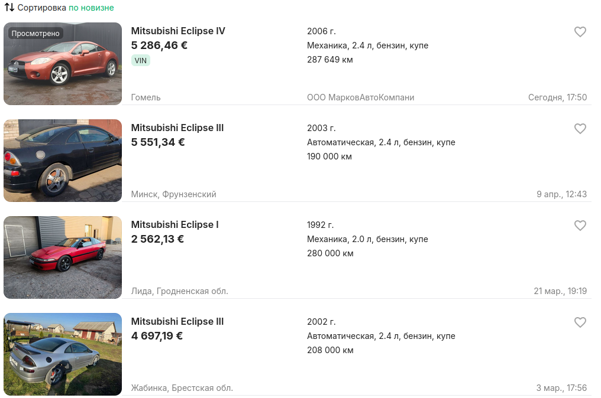

# Kufar.by Валюты

Браузерное расширение (Manifest V3) для Firefox и Chrome-based браузеров, которое автоматически заменяет цены на Kufar.by из белорусских рублей (BYN) в выбранную валюту: USD, EUR или RUB. Курсы берутся из публичного API Национального банка Республики Беларусь.

Основная функция расширения — менять отображаемые цены на страницах Kufar, чтобы пользователь сразу видел стоимость товара в удобной валюте.

## Возможности

- Замена цен на Kufar.by из BYN в USD, EUR или RUB.
- Возврат к оригинальным ценам в BYN при выборе валюты `BYN`.
- Поддержка цен в списках объявлений, карточках товаров, боковых панелях и блоках рекомендаций.
- Сохранение выбранной валюты в локальном хранилище браузера.
- Popup с текущими курсами НБРБ и простым конвертером валют.
- Автоматическое обновление курсов каждые 4 часа.
- Работа с кэшированными курсами, если API временно недоступен.
- Переключатели для отдельных доменов Kufar (auto, re, travel).

## Как пользоваться

1. Установите расширение в Firefox или Chrome-based браузер.
2. Откройте popup расширения (нажмите на иконку в панели инструментов).
3. В поле `Валюта для цен на Kufar` выберите `USD`, `EUR`, `RUB` или `BYN`.
4. Откройте или обновите страницу на `https://auto.kufar.by/`.
5. Цены на странице будут заменены на выбранную валюту.

### Конвертер

В popup расширения есть встроенный конвертер валют:

1. Введите сумму в поле ввода.
2. Выберите валюту (USD, EUR или RUB).
3. Результат в BYN отобразится автоматически.

### Переключатели доменов

В секции «Сайты Kufar» можно включить или выключить замену цен для конкретных разделов:

- **Авто** (auto.kufar.by) — поддерживается в текущей версии.
- **Недвижимость**, **Путешествия**, **Куфар (основной)** — планируются в будущих версиях.

Переключатель `везде` управляет всеми активными доменами одновременно.

## Поддерживаемые сайты

| Домен           | Статус         |
| --------------- | -------------- |
| auto.kufar.by   | Поддерживается |
| re.kufar.by     | Планируется    |
| travel.kufar.by | Планируется    |
| kufar.by        | Планируется    |

## Скриншоты

<details>
<summary>Показать скриншоты</summary>




</details>

---

## Модули

### `manifest.json`

Базовый манифест расширения: имя, версию, разрешения, popup, background script и content script для Kufar.

Для Firefox используется исходный `manifest.json`, а для Chrome build-скрипт генерирует совместимый манифест в `build/chrome/manifest.json`.

Важные разрешения:

- `storage` — хранение курсов, ошибок обновления и выбранной валюты.
- `alarms` — периодическое обновление курсов.
- `https://api.nbrb.by/*` — загрузка курсов НБРБ.
- `https://kufar.by/*`, `https://*.kufar.by/*` — запуск content script на Kufar.

### `background.js`

Фоновый модуль расширения.

Функции:

- Загружает курсы НБРБ с таймаутом 15 секунд.
- Проверяет, что в ответе есть USD, EUR и RUB.
- Сохраняет валидные курсы в `browser.storage.local`.
- Не перезаписывает последние валидные курсы при ошибке API.
- Обновляет курсы при установке, запуске браузера, по расписанию (каждые 4 часа) и по кнопке `Обновить` в popup.
- Отвечает на сообщения: `getRates`, `refreshRates` и `ensureRates`.
- Предотвращает дублирование запросов через `fetchInProgress`.

### `content/kufar.js`

Content script, который работает на страницах Kufar.

Функции:

- Читает выбранную валюту и сохраненные курсы из `browser.storage.local`.
- Находит элементы цен на странице Kufar в безопасных контейнерах.
- Сохраняет оригинальный BYN-текст в `data-kufar-original-price-text`, чтобы можно было точно вернуть исходное отображение.
- Конвертирует BYN в выбранную валюту.
- Заменяет цену на странице без добавления второго значения рядом.
- Обрабатывает динамически добавленные элементы через `MutationObserver` с debounce через `requestAnimationFrame`.
- Реагирует на изменение выбранной валюты без перезагрузки страницы.
- Игнорирует «Договорная», «Бесплатно», «Обмен», «Цена не указана».

**Особенность:** Content script является самодостаточным IIFE без импортов. Функции `parseBynPrice`, `convertFromBYN`, `formatDisplayPrice` дублированы из `lib/rates.js`.

### `lib/rates.js`

Чистый модуль бизнес-логики без зависимостей от браузерных API.

Функции:

- `parseRates` — извлекает USD, EUR и RUB из ответа API НБРБ.
- `convert` — переводит сумму из выбранной валюты в BYN.
- `convertFromBYN` — переводит сумму из BYN в выбранную валюту.
- `parseBynPrice` — извлекает числовую цену из текста Kufar.
- `formatDisplayPrice` — форматирует цену для отображения на странице.
- `formatRateLabel`, `formatRate`, `formatDate`, `formatTime` — форматирование курсов и дат для popup.

### `popup/`

Интерфейс расширения.

Функции:

- Показывает текущие курсы USD, EUR и RUB к BYN с флагами стран.
- Показывает время последнего обновления.
- Позволяет вручную обновить курсы.
- Содержит простой конвертер валют в BYN.
- Позволяет выбрать валюту, в которую будут заменяться цены на Kufar.
- Показывает переключатели для каждого домена Kufar.
- Отображает статус «планируется» для неподдерживаемых доменов.

### `tests/`

Тесты на Vitest.

Покрывают:

- Парсинг ответа НБРБ.
- Конвертацию валют.
- Форматирование цен.
- Поведение content script на сохраненных HTML-примерах Kufar.
- Восстановление оригинальных BYN-цен.

### `scripts/build-chrome.mjs`

Build-скрипт для Chrome-based браузеров.

Функции:

- Создает `build/chrome/`.
- Копирует файлы расширения для Chrome-пакета.
- Генерирует `build/chrome/manifest.json` из `manifest.json` (заменяет background на `service_worker`, удаляет `browser_specific_settings`).
- Добавляет в `build/chrome/README_CHROME_INSTALL.txt` инструкции по установке.

В исходных entrypoint-файлах (`background.js`, `content/kufar.js`, `popup/popup.js`) есть shim `globalThis.browser ??= globalThis.chrome;`, чтобы один код работал с Firefox `browser.*` и Chrome `chrome.*` API.

---

## Приватность

Расширение не собирает и не передает пользовательские данные. Оно обращается только к API НБРБ для получения курсов валют и работает локально с DOM страниц Kufar.

Выбранная валюта, настройки доменов и последние курсы хранятся локально в браузере через `browser.storage.local`.

---

## Установка

### Firefox

1. Скачайте `kufar-currencies-firefox.zip` из [Releases](../../releases) или соберите сами.
2. Откройте `about:addons` в Firefox.
3. Нажмите на шестеренку → «Установить дополнение из файла...».
4. Выберите ZIP-файл.

### Firefox (временная установка для разработки)

1. Откройте `about:debugging#/runtime/this-firefox`.
2. Нажмите «Загрузить временное дополнение».
3. Выберите `manifest.json` в корне проекта.

### Firefox для Android

1. Соберите расширение: `npm run build:android`.
2. Загрузите `kufar-currencies-firefox.zip` на устройство.
3. Установите через Firefox Nightly или Beta с включенными расширенными настройками.

### Chrome / Edge / Brave

1. Скачайте `kufar-currencies-chrome.zip` из [Releases](../../releases) или соберите сами.
2. Распакуйте архив.
3. Откройте `chrome://extensions` (или аналог в вашем браузере).
4. Включите «Режим разработчика».
5. Нажмите «Загрузить распакованное расширение».
6. Выберите папку `build/chrome`.

---

## Разработка

### Требования

- Node.js 18+
- npm

### Установка зависимостей

```bash
npm install
```

### Команды разработки

```bash
# Запуск всех тестов
npm test

# Тесты в режиме наблюдения
npm run test:watch

# Тесты с покрытием
npm run test:coverage

# Проверка форматирования
npm run format:check

# Форматирование кода
npm run format

# Линтер (web-ext)
npm run lint

# Сборка Firefox
npm run build:firefox

# Сборка Chrome
npm run build:chrome

# Полная сборка (Firefox + Chrome)
npm run build
```

### Запуск тестов отдельно

```bash
# Unit-тесты для lib/rates.js
npx vitest run tests/parse.test.js

# JSDOM-тесты для content script
npx vitest run tests/content.test.js
```

### Структура проекта

```
kufar_currencies/
├── manifest.json              # Manifest V3, entrypoints, разрешения
├── background.js               # Background service worker — сеть, кэш, alarms
├── lib/
│   └── rates.js                # Чистые функции: parseRates, convertFromBYN, форматирование
├── content/
│   └── kufar.js                # IIFE content script — DOM, замена цен, MutationObserver
├── popup/
│   ├── popup.html              # Разметка popup
│   ├── popup.css               # Стили popup
│   └── popup.js                # Логика popup, импорты из lib/rates.js
├── scripts/
│   └── build-chrome.mjs        # Chrome build: удаляет Gecko-ключи, service_worker
├── tests/
│   ├── parse.test.js           # Unit-тесты для lib/rates.js
│   └── content.test.js         # JSDOM-тесты для content script
├── examples/
│   ├── auto/                   # HTML-фикстуры с auto.kufar.by
│   ├── real_estate/            # HTML-фикстуры с re.kufar.by (будущее)
│   ├── nbrb_response.json      # Пример ответа API НБРБ
│   └── screenshots/            # Скриншоты расширения
├── icons/                      # Иконки расширения (SVG + PNG)
├── vitest.config.js            # Конфигурация тестов, 80% coverage для lib/
└── build/
    └── chrome/                 # Chrome-сборка (генерируется)
```

### Архитектурные границы

- **Сетевой доступ только в `background.js`.** Никаких `fetch`/`XMLHttpRequest` в других файлах.
- **`lib/rates.js` не содержит браузерных API.** Тестируется в чистом Node.
- **`content/kufar.js` — самодостаточный IIFE.** Без `import`, без `fetch`, без `innerHTML`.
- **Никакого `innerHTML`** в production-коде. Только `textContent`, `createElement`, `appendChild`.
- **Конвертация всегда из оригинальной суммы BYN.** Никогда не конвертируем уже конвертированное значение.
- **`DOMAIN_REGISTRY`** должен быть синхронизирован между `content/kufar.js` и `popup/popup.js`.

### Покрытие тестами

Порог покрытия: 80% lines/functions/branches/statements для `lib/**/*.js` (см. `vitest.config.js`).

---

## Ссылки


[Расширение в Addons Mozilla.org](https://addons.mozilla.org/en-US/firefox/addon/kufar-by-%D0%B2%D0%B0%D0%BB%D1%8E%D1%82%D1%8B/)

[Расширение в Chrome Webstore](#)


---

## ID расширения Firefox

В `manifest.json` задан стабильный ID:

```json
"id": "kufar-by-currencies@redpandadev"
```

ID можно менять до первого публичного релиза. После релиза его лучше не менять, потому что Firefox использует ID для идентичности расширения, обновлений и локальных данных.

Если расширение будет публиковаться в AMO как новое listed add-on, Firefox Add-ons может назначить ID автоматически. Для self-hosted, unlisted или стабильного локального тестирования фиксированный ID в манифесте полезен.

---

## Лицензия

См. файл [LICENSE](LICENSE).
